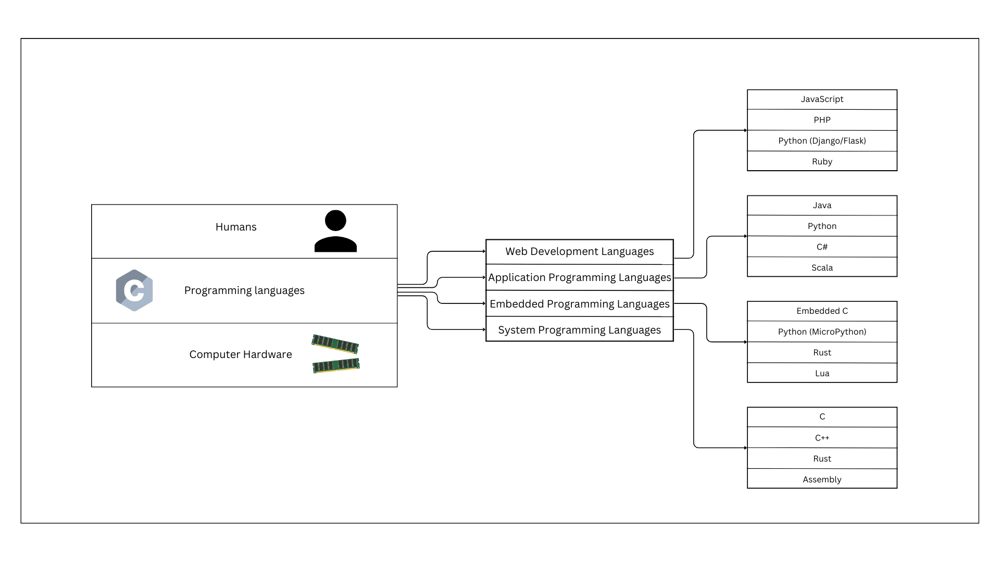

---
authors:
  - arockiaraj1994
categories:
  - Programming
date:
  created: 2024-01-31 
  updated: 2024-02-01
---

# Why Computer Programming is Important? What is the Need? 

I took an example if Banking to explain the need for computer programming, So that every one can easily understand the need for computer programming.

Let me explain the evolution of banking, which is a great example of how technology has transformed industries.

**Bank Visits**: Earlier, checking balance or transferring money required visiting a bank and waiting in long queues.

**ATMs**: Automated Teller Machines (ATMs) allowed customers to withdraw cash, check balances, and deposit money without entering a bank.

**Online Banking**: Internet banking enabled users to manage accounts, transfer funds, and pay bills from anywhere using secure websites.

**NEFT & RTGS**: Electronic fund transfers like NEFT and RTGS allowed faster and more secure money transfers between banks.

**IMPS**: Immediate Payment Service (IMPS) introduced real-time 24/7 money transfers, making banking instant and seamless.

**UPI**: Unified Payments Interface (UPI) enabled instant transactions using mobile numbers and QR codes, simplifying digital payments.

**Chat based banking**: Chat-based banking services like Google Pay and PhonePe's chatbots now allow users to check balances, transfer funds, and perform banking tasks via messaging apps.

Now you can understand the need for computer programming in our daily life. It's just a simple example, but it shows how programming has transformed various aspects of our lives.

## What is Computer Programming?

Let say If we want to coommunicate with someone, we need to know their language. Similarly, to communicate with a computer, we need to use a programming language.

If I wanted to communicate with you, I would need to know English. Similarly, to communicate with a computer, we need to use a programming language like Python, Java, or C++.

Likewise, I have a hardware (computer), How should I tell a computer to do something? That's where programming comes in. 
A small and basic illustration of programming is shown below:

Programming language allows developers to create software applications, automate processes, analyze data, and build intelligent systems.
